# Multi-Label Chest Pathology XAI

[](https://pytorch.org/)
[](https://fastapi.tiangolo.com/)
[](https://react.dev/)
[](https://tailwindcss.com/)
[](LICENSE)

An end-to-end medical AI workspace for 14-class multi-label chest pathology detection on the NIH ChestX-ray14 dataset. Combines high-capacity vision backbones (ConvNeXt-Small & DenseNet-121), HiResCAM/LayerCAM visual explainability, a zero-disk in-memory FastAPI backend, and a single-screen React diagnostic frontend.

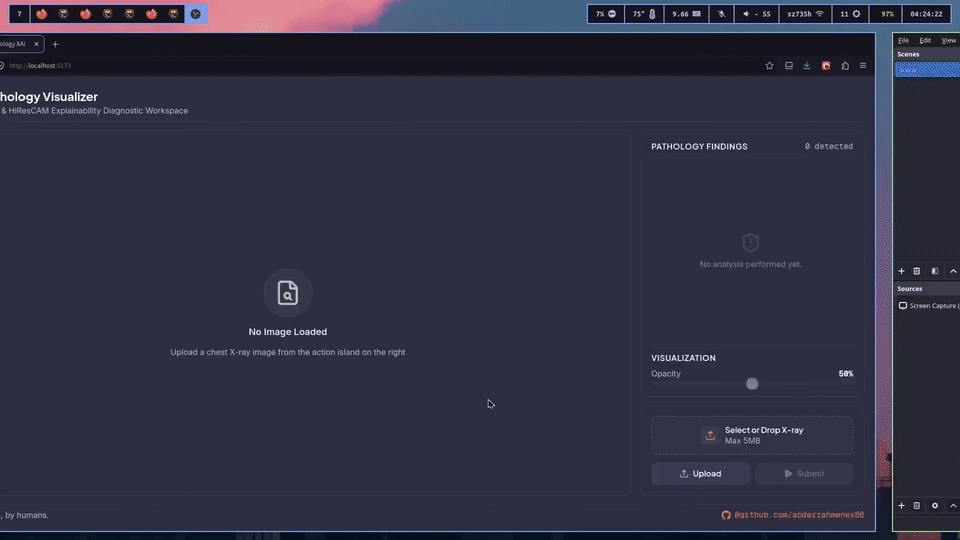

______________________________________________________________________

## Key Features

- **High-Performance Vision Backbones:** Out-of-the-box support for `convnext_small` (85.83% AUROC), `densenet121` (84.88% AUROC), `resnet50`, and `efficientnet_b2`.
- **HiResCAM / LayerCAM Visual Explainability:** Generates element-wise gradient-activation heatmaps (`F.relu(gradients * activations)`) that strictly localize pathology lesions while eliminating spurious background and shoulder artifacts.
- **Decoupled Transparent Base64 Heatmap Overlay:** Backend returns a transparent BGRA PNG encoded as Base64. The React frontend overlays the heatmap over the base X-ray using CSS absolute positioning, enabling 60fps real-time opacity adjustments without server re-inference.
- **Per-Class Optimal Decision Thresholds:** Evaluates Youden's J Statistic ($J = \\text{Sensitivity} + \\text{Specificity} - 1$) per disease to reliably flag rare pathologies (e.g. Hernia at $0.02$, Pneumonia at $0.12$).
- **FastAPI Zero-Disk Streaming:** Streams uploads directly in RAM memory buffers (`io.BytesIO`) for sub-second API latency.
- **Single-Screen Viewport UI:** Designed with custom Tailwind v4 `@theme` tokens (`bg-slate-dark`, `text-pure-white`, `coral-orange` accent) fitting standard desktop viewports without vertical scrolling.

______________________________________________________________________

## Dataset & Exploratory Data Analysis (EDA)

The pipeline trains on the **NIH ChestX-ray14** dataset (112,120 chest radiographs across 30,805 unique patients). Patient overlap between train and validation splits is strictly prevented by splitting on unique Patient IDs.

### Class Distribution

<!-- | Pathology Class | Positive Count | Prevalence (%) | -->

<!-- | :--- | :--- | :--- | -->

<!-- | **Infiltration** | 19,894 | 17.7% | -->

<!-- | **Effusion** | 13,317 | 11.9% | -->

<!-- | **Atelectasis** | 11,559 | 10.3% | -->

<!-- | **Nodule** | 6,331 | 5.6% | -->

<!-- | **Mass** | 5,782 | 5.2% | -->

<!-- | **Pneumothorax** | 5,302 | 4.7% | -->

<!-- | **Consolidation** | 4,667 | 4.2% | -->

<!-- | **Pleural Thickening** | 3,385 | 3.0% | -->

<!-- | **Cardiomegaly** | 2,776 | 2.5% | -->

<!-- | **Emphysema** | 2,516 | 2.2% | -->

<!-- | **Edema** | 2,303 | 2.1% | -->

<!-- | **Fibrosis** | 1,686 | 1.5% | -->

<!-- | **Pneumonia** | 1,431 | 1.3% | -->

<!-- | **Hernia** | 227 | 0.2% | -->

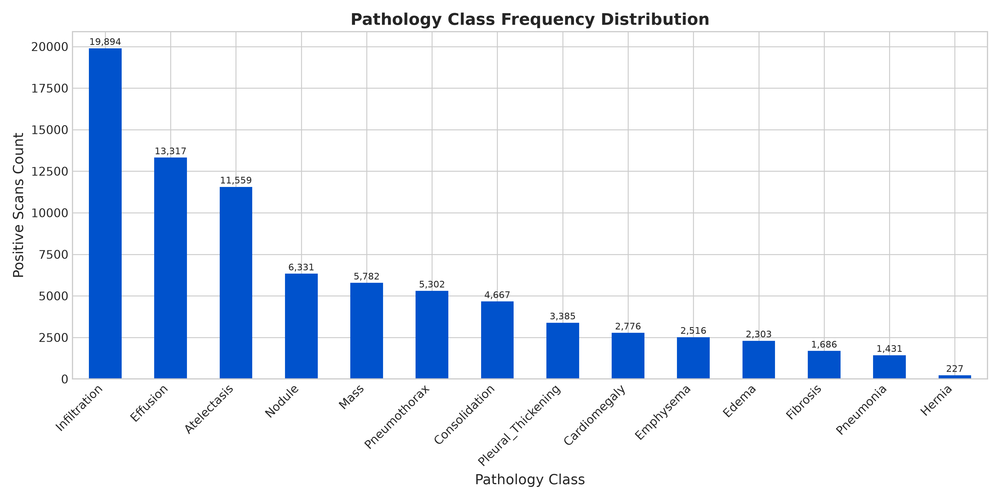

### Co-Occurrence Matrix

The diagonal of the $14 \\times 14$ co-occurrence matrix isolates **solitary diagnoses** (pathologies diagnosed alone), while off-diagonal elements measure overlapping multi-label co-occurrences.

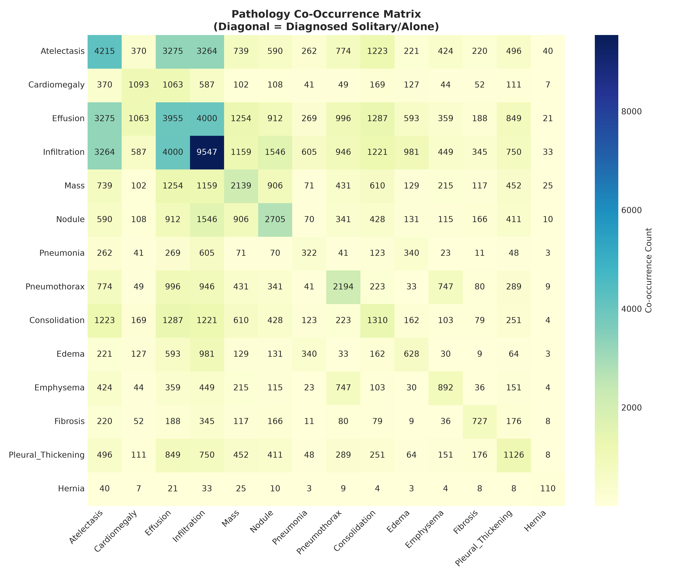

### Demographics & View Positions

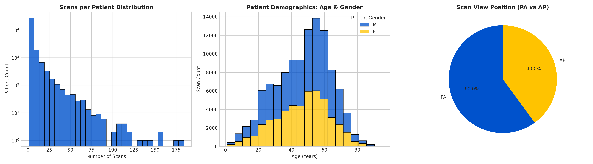

______________________________________________________________________

## Model Benchmarks & Anti-Overfitting Strategy

### Training Strategy

To prevent severe overfitting during fine-tuning:

1. **Clamped Loss Weights (`max=10.0`):** Clamps raw positive loss weights $N\_{\\text{neg}} / N\_{\\text{pos}}$ to prevent logit and validation loss explosion.
1. **Sequential LR Scheduler:** `LinearLR` (2 warmup epochs) chained into `CosineAnnealingLR` decaying down to `1e-6`.
1. **Heavy Weight Decay (`AdamW` `1e-4`):** Regularizes parameters with CUDA Fused AdamW updates.
1. **Early Stopping (`patience=5`):** Automatically halts training when validation AUROC halts improvement.

### Pre-Training Augmentation Sanity Check

Before training starts, `src/utils.py` saves a 5-stage augmentation breakdown (`Original` $\\rightarrow$ `Resize` $\\rightarrow$ `Horizontal Flip` $\\rightarrow$ `Affine Rotation` $\\rightarrow$ `Contrast Jitter`) to verify spatial transformations.

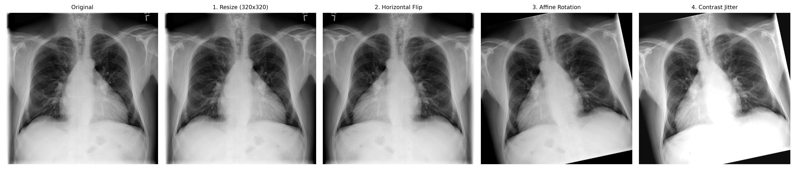

### Benchmark Results

`convnext_small` achieved a peak **0.8583 (85.83%) Validation AUROC**, outperforming standard literature baselines (CheXNet ~0.841).

| Architecture | Parameters | Input Resolution | Peak Val AUROC | Peak Val AUPRC |
| :--- | :--- | :--- | :--- | :--- |
| **ConvNeXt-Small** | **50.0 M** | **320 × 320** | **0.8583** | **0.2935** |
| **DenseNet-121** | **7.0 M** | **320 × 320** | **0.8488** | **0.2812** |

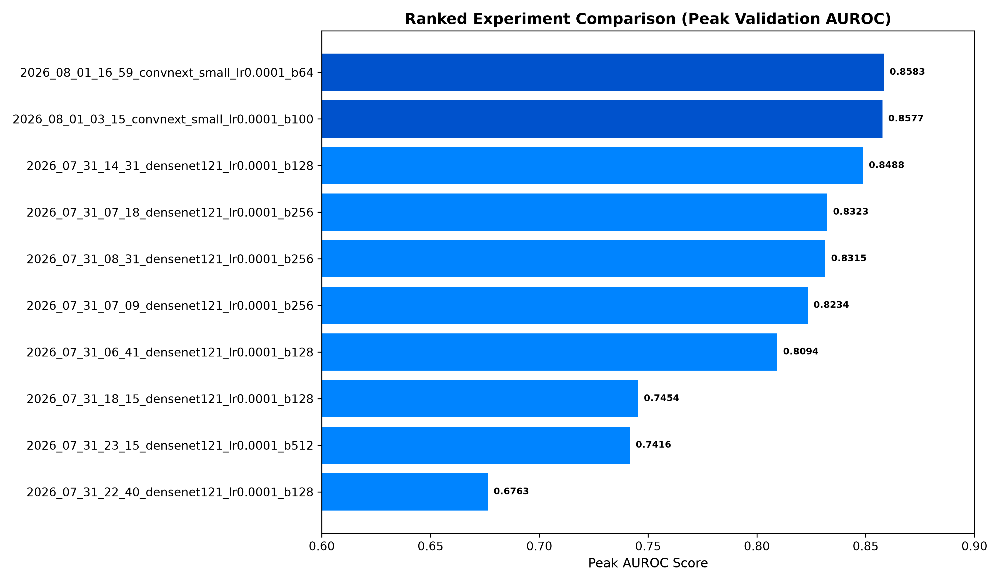
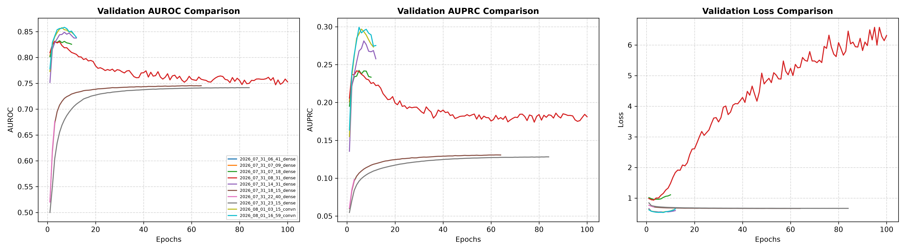

______________________________________________________________________

## Decision Thresholds & Confusion Matrices

### Youden's J Optimal Thresholds

Because rare diseases (e.g. Hernia at 0.2% prevalence) produce lower raw logits, decision thresholds are optimized per-class using Youden's J statistic ($J = \\text{Sensitivity} + \\text{Specificity} - 1$):

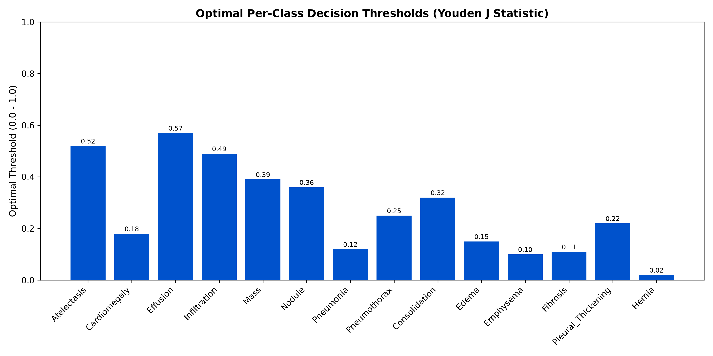

### Validation Confusion Matrices ($2 \\times 2$ Grid per Pathology)

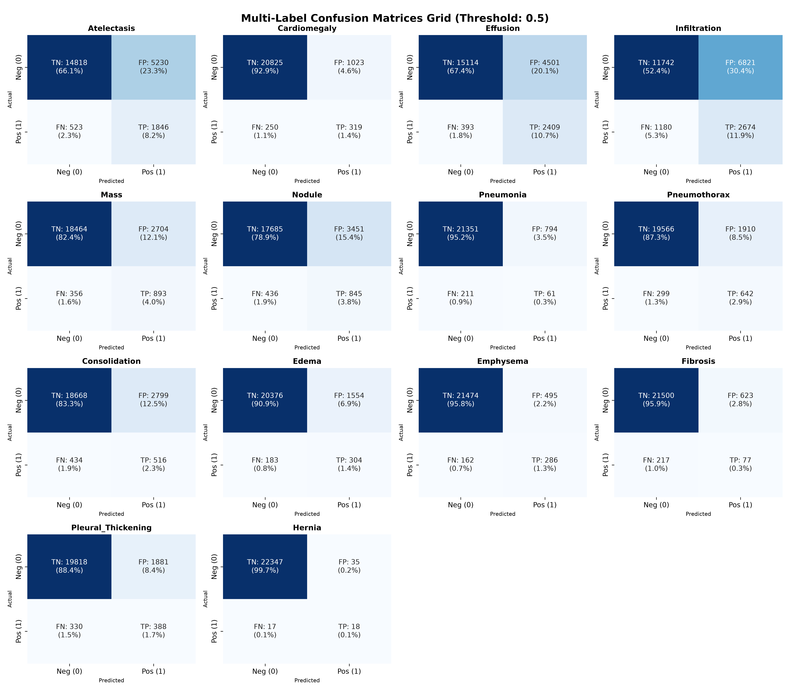

______________________________________________________________________

## Visual Explainability (HiResCAM Overlays)

HiResCAM computes the element-wise product of positive gradients and activations (`F.relu(gradients * activations)`), eliminating background shoulder and tubing artifacts.

| Disease Finding | HiResCAM Overlay Prediction |
| :--- | :--- |
| **Effusion (84.1%)** | 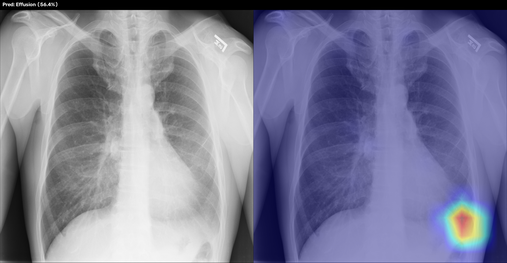 |
| **Infiltration (63.2%)** | 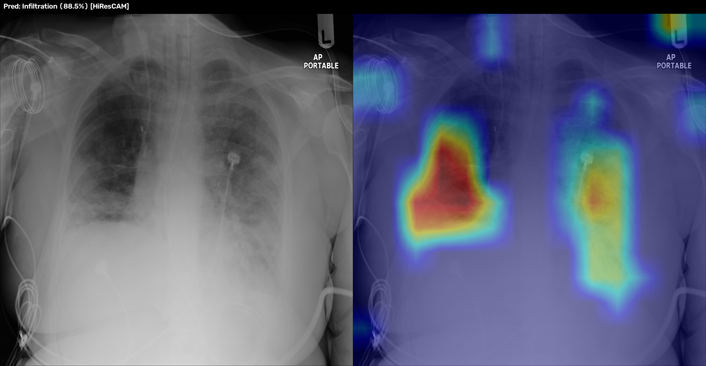 |
| **Edema (72.4%)** | 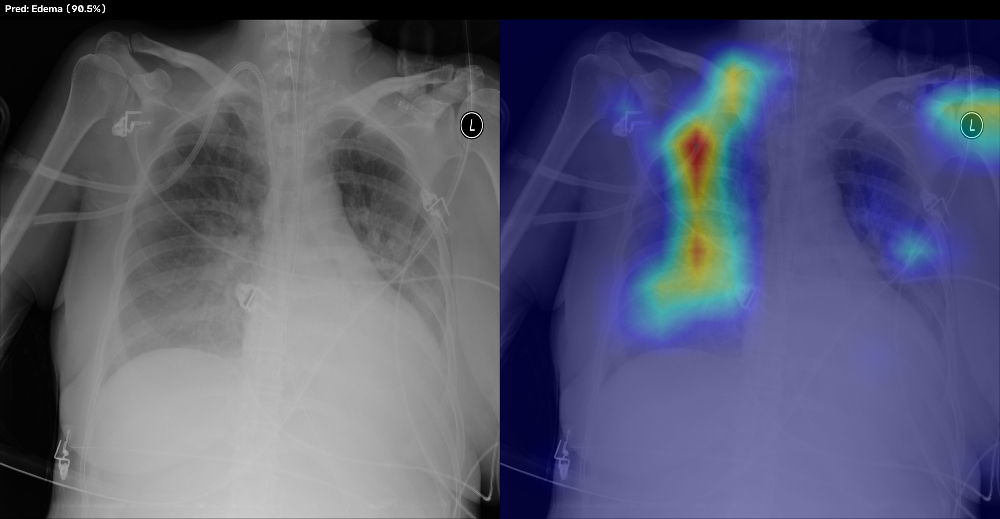 |
| **Atelectasis (81.0%)** | 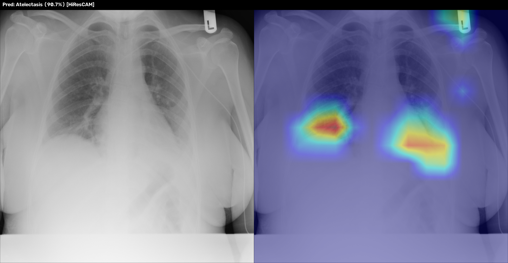 |

______________________________________________________________________

## Quickstart Guide

### 1. Environment Setup

```bash
git clone https://github.com/abderrahmenex86/Multi-Label-Chest-Pathology-XAI.git
cd Multi-Label-Chest-Pathology-XAI

python -m venv venv
source venv/bin/activate
pip install -r requirements.txt
```

### 2. Dataset Download

Download `Data_Entry_2017.csv` and the 12 split NIH image archives automatically:

```bash
python src/train.py --download --sanity
```

### 3. Model Training

Train a ConvNeXt-Small model at $320 \\times 320$ resolution:

```bash
python src/train.py --architecture convnext_small --batch 64 --epochs 50
```

### 5. Launch FastAPI Backend

```bash
python backend/main.py --host 0.0.0.0 --port 8000
```

### 6. Launch React Frontend

```bash
cd frontend
npm install
npm run dev
```

Open `http://localhost:5173` in your browser.
